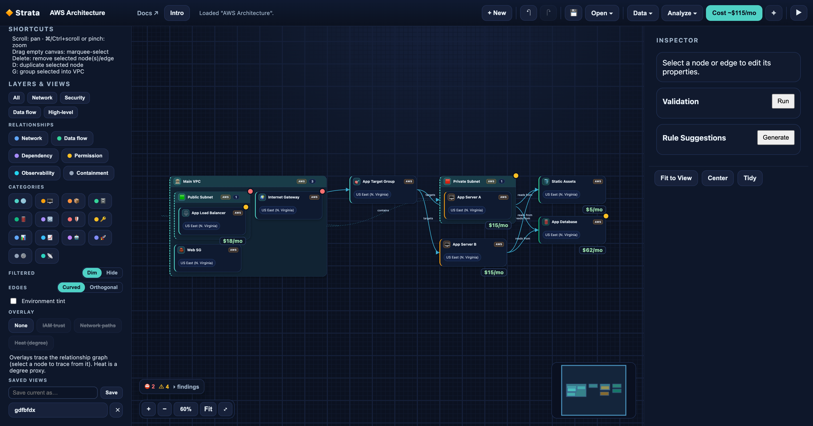

# Strata

**Live app: [strata.mk-dir.com](https://strata.mk-dir.com/)**



A registry-driven canvas for **modeling cloud infrastructure as a typed graph**.
Drag services onto a canvas, configure them with auto-generated forms, and connect
them with typed relationships (`contains`, `routes_to`, `invokes`, `peers_with`, …)
— with a multi-cloud catalog spanning AWS, Google Cloud and Azure. It can also import
existing Infrastructure-as-Code — CloudFormation (JSON/YAML), Terraform
`show -json` (AWS/GCP/Azure) and Azure ARM — into the same graph, export the graph
back out as IaC, and ingest live cloud state via provider discovery APIs.

On top of the graph sits a layer of **pure analysis engines** — validation with
one-click autofix, true internet-reachability evaluation, an "Explain & Clean"
account review (cost + risk + a safe-cleanup checklist), cross-cloud migration
mapping, a change/audit receipt between any two versions, tag tinting/filtering,
canvas annotations, and a Diagram-as-Code DSL — all exposed both in the UI and
over MCP.

## MCP server

An LLM/agent can drive Strata over the [Model Context Protocol](https://modelcontextprotocol.io).
The server (`src/mcp/server.ts`) is a thin wrapper over the same pure engines the
app uses — registry, validation, IaC import/export, and cost — so an agent can
query and transform a graph exactly as the UI does. No DOM, network, or
credentials.

Run it (stdio transport; uses `npx tsx`, no build step):

```bash
npm run mcp
```

Then point an MCP client at that command, e.g.:

```jsonc
{
  "mcpServers": {
    "strata": { "command": "npm", "args": ["run", "mcp"], "cwd": "/path/to/strata" },
  },
}
```

**Tools:** `list_services`, `get_service`, `validate_architecture`,
`suggest_rules`, `import_iac`, `export_iac`, `estimate_cost`,
`review_account` (cost + risk + safe-cleanup report), `evaluate_reachability`
(true internet-reachability, not topology), `map_to_cloud` (cross-cloud
equivalence), `graph_to_dsl` / `graph_from_dsl` (Diagram-as-Code round-trip),
`list_autofixes` / `apply_autofix` (deterministic validation fixes),
`change_receipt` (audit receipt of what changed between two graphs),
`tag_report`.

> Live cloud discovery is separate — it runs through a Cloud Control SDK route
> (`src/app/api/discover/route.ts`); `src/aws/mcp.ts` is the pure transform behind
> it. See [CONTRIBUTING.md](./CONTRIBUTING.md) for the architecture.

The core idea: **everything visual is derived from a data registry, not hardcoded.**
Adding a new AWS service is a single catalog entry — no UI changes.

Strata is **open source**. Contributions welcome.

## Documentation

Strata ships its docs as part of the app, served at **`/docs`**, in two public
sections:

- **User Guide** (`/docs/guide`) — how to use the app: building diagrams, importing
  IaC, validation, and saving/loading.
- **Architecture & Engineering** (`/docs/architecture`) — how it works internally:
  the service registry, domain model, persistence, MCP/IaC import, testing, and the
  roadmap.

The docs are authored as Nextra MDX under `src/content/`.

## Quick Start

Strata is now a **single app**: `npm run dev` serves the product at `/` and the docs
at `/docs`.

```bash
npm install
npm run dev
```

- Product: http://localhost:3000/
- Docs: http://localhost:3000/docs

Saved diagrams persist in **your browser** (`localStorage`) — **no external
infrastructure required**, and it works on a read-only serverless host. Use
**Export / Import JSON** to move a diagram between browsers or share it. (The
server-side `Repository` + `/api/graphs` route remain for a future durable
backend, but the app no longer relies on them for saving.)

### Other scripts

```bash
npm run build   # production build (compiles the product and prerenders the docs)
npm run start   # run the production build
npm run lint    # lint
npm test        # run the Vitest suite
```

### Configuration

| Env var                     | Default        | Purpose                                                                |
| --------------------------- | -------------- | ---------------------------------------------------------------------- |
| `AWS_FLOW_REPOSITORY`       | `file`         | Backend for the retained server tier (not used by browser-local save). |
| `AWS_FLOW_DATA_DIR`         | `.data/graphs` | Directory for the file-backed store (retained server tier only).       |
| `AWS_FLOW_API_TOKEN`        | _(unset)_      | If set, the graph API requires `Authorization: Bearer <token>`.        |
| `NEXT_PUBLIC_STRATA_HOSTED` | _(unset)_      | Set to `1` on any **shared/hosted** deployment (see below).            |
| `STRATA_INTEREST_WEBHOOK`   | _(unset)_      | Incoming-webhook URL to notify on "coming soon" interest (see below).  |

#### "Coming soon" interest notifications

When `NEXT_PUBLIC_STRATA_HOSTED=1`, clicking a **"coming soon"** prompt's _"I'd
use this"_ button POSTs a tiny `{ feature, note? }` signal to the same-origin
**`/api/interest`** route (it's skipped locally — there's nothing to collect on a
single-user box). That route, with **no datastore and no npm dependency**:

- always **logs** the signal (so it shows in your host's function logs, e.g.
  Vercel), and
- if **`STRATA_INTEREST_WEBHOOK`** is set, forwards a short message to that
  incoming-webhook URL. Use whatever gives you a notification with zero infra — a
  **Slack** or **Discord** incoming webhook (phone push), **ntfy.sh** (push), or a
  webhook→email relay. The body sends both `text` (Slack) and `content` (Discord),
  so one URL works for either. No credentials are involved, and the endpoint
  accepts only a small validated payload.

#### Live discovery & credentials

The **Connect to AWS → Live scan** flow runs server-side. With no credentials in
the request, it uses the server process's _default credential chain_ (env vars /
shared profile / SSO / instance role) — fine for a **single-user local** run,
where those are your own credentials.

On a **shared/hosted** deployment that ambient chain would be the _operator's_
account, so any visitor could enumerate it. Set **`NEXT_PUBLIC_STRATA_HOSTED=1`**
(at build _and_ runtime) to disable the ambient fallback: each user must then
bring their own AWS credentials, entered in the modal and sent over HTTPS for a
single scan. Those keys are used in-memory only — never written to disk, logged,
returned, or saved into a diagram. Users should supply **temporary, read-only**
credentials (e.g. `aws sts get-session-token`, or an assumed `ReadOnlyAccess`
role). The credential-free **Paste export** tab remains available either way.

## Project Structure

```
src/
  aws/                  Registry + domain model (the data foundation)
    types.ts            ServiceDefinition, ConfigField, RelationshipKind, scopes
    registry.ts         Aggregates catalogs; lookups, search, validateRegistry()
    categories.ts       Category + relationship presentation metadata
    model.ts            InfrastructureGraph / ResourceInstance / Relationship, validateGraph()
    regions.ts          AWS region reference list
    rules.ts            Architecture validation + best-practice rule suggestions
    relationshipClasses.ts  Edge visual encoding (colour/dash/arrowhead per class)
    overlays.ts         Analytical overlays (IAM-trust, network path, heat, reachability, tags) — pure
    reachability.ts     Policy-aware internet-reachability eval (subnets/routes/SG ports) — pure
    review.ts           "Explain & Clean" account review: cost + risk + safe-cleanup checklist — pure
    cloudMap.ts         Cross-cloud equivalence / migration (serviceId+provider rewrite) — pure
    autofix.ts          Deterministic fixes for validation findings (detect + apply) — pure
    receipt.ts          Change/audit receipt between two graphs (drift + cost + findings) — pure
    tags.ts             Tag collection + tint map + tag filter — pure
    annotations.ts      Notes / callouts / zones pinned to the canvas (excluded from rules/cost/IaC) — pure
    dsl.ts              Diagram-as-Code: graph ⇄ YAML round-trip — pure
    iac.ts              IaC import (CloudFormation + Terraform → InfrastructureGraph)
    iacExport.ts        IaC export (InfrastructureGraph → CloudFormation / Terraform scaffold)
    mcp.ts              Pure transform: DiscoveredResource[] → graph (mapDiscoveredToGraph)
    discovery.ts        Cloud Control descriptions → DiscoveredResource[] (no AWS SDK here)
    services/*.ts       Per-category service catalogs (networking.ts is the template)
  canvas/               Pure geometry + containment layout (geometry.ts, layout.ts)
  server/               Retained server tier (kept for a future durable backend)
    repository.ts       Repository interface
    fileRepository.ts   Default file-backed store
    graphSchema.ts      Zod schema for graph validation
    auth.ts             Optional bearer-token guard (AWS_FLOW_API_TOKEN)
    index.ts            getRepository() — backend selection via env
  lib/
    localStore.ts       Browser localStorage save/load (the active persistence path)
    api.ts              Fetch client for the graph + discover APIs (discover is live)
  app/
    (product)/          The Strata canvas app, served at /
    (docs)/             Nextra docs, served at /docs
    api/graphs/         Graph REST Route Handlers (GET/POST, GET/PUT/DELETE by id)
    api/discover/       Live discovery Route Handler (Cloud Control SDK, server-only)
  components/           UI: Palette, Canvas, Inspector, CommandPalette
  hooks/                Canvas state, rendering, interaction, undo/redo
  content/              Nextra MDX docs (User Guide + Architecture), served at /docs
```

### Adding a new AWS service

Append one `ServiceDefinition` to the matching catalog in `src/aws/services/`
(use `networking.ts` as the template) — the palette, colours, icons, inspector
form, and search pick it up automatically. See the
[Service Registry docs](https://strata.mk-dir.com/docs/architecture/service-registry).

## Architecture

For the full design — registry schema, domain model, the registry-driven UI, the
swappable persistence layer, MCP ingestion readiness, and a candid list of gaps and
next steps — see the **[Architecture & Engineering docs](https://strata.mk-dir.com/docs/architecture)**
(`src/content/architecture/`).

## Roadmap

What's shipped, the active follow-ups, and what's deferred until a backend exists:
see [ROADMAP.md](./ROADMAP.md).

## Tech Stack

Next.js (App Router) · React · TypeScript · Tailwind CSS · Nextra (docs).
