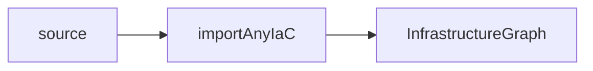

# The Docs Site — How It's Built & How to Add a Page

This documentation is **part of the product app**, not a separate project. One
Next.js app builds and deploys both the product and the docs:
[Nextra 4](https://nextra.site/) powers everything under `/docs`, served via the
`(docs)` App Router route group, while the product lives under `(product)`.

## The pieces

| Piece                                         | What it does                                                                     |
| --------------------------------------------- | -------------------------------------------------------------------------------- |
| `next.config.mjs`                             | Wraps the Next config in `nextra({ contentDirBasePath: "/docs" })`.              |
| `src/content/**`                              | The MDX source. Folder structure maps to URLs under `/docs`.                     |
| `src/content/**/_meta.ts`                     | Per-folder nav: declares page order + sidebar titles.                            |
| `src/mdx-components.tsx`                      | Merges Nextra's docs-theme MDX components with overrides (required by Nextra 4). |
| `src/app/(docs)/layout.tsx`                   | The docs root layout: theme CSS, `Navbar`, `Footer`, page map.                   |
| `src/app/(docs)/docs/[[...mdxPath]]/page.tsx` | The catch-all route that compiles and renders each MDX file.                     |

### Content → URL mapping

`contentDirBasePath: "/docs"` means a file at
`src/content/architecture/rules-engine.mdx` is served at
`/docs/architecture/rules-engine`. `index.mdx` in a folder is that folder's root
(`src/content/architecture/index.mdx` → `/docs/architecture`). Internal links in
the MDX are written as absolute doc paths, e.g.
`[Testing](/docs/architecture/testing)`.

### Navigation (`_meta.ts`)

Each content folder has a `_meta.ts` default-exporting an **ordered** object of
`fileBasename → sidebar title`. Order in the object **is** sidebar order; the key
must match the file name without its extension. The three that matter here:

- `src/content/_meta.ts` — top level (`Introduction` / `User Guide` / `Architecture & Engineering`).
- `src/content/architecture/_meta.ts` — the engineering section (this folder).
- `src/content/guide/_meta.ts` — the user guide (owned elsewhere; don't edit from
  the architecture side).

A page that exists on disk but is **missing from its `_meta.ts`** still resolves by
URL but won't appear in the sidebar in the intended position — so always add the
entry.

### The catch-all route

`src/app/(docs)/docs/[[...mdxPath]]/page.tsx` is the single dynamic route that
serves every doc. It uses Nextra's `nextra/pages` helpers:

- `generateStaticParamsFor("mdxPath")` — statically enumerates every doc path at
  build time.
- `importPage(mdxPath)` — compiles the matching MDX, returning its default
  component, `toc`, `metadata`, and `sourceCode`.
- `generateMetadata` returns the page's `metadata` (driven by the `title`
  frontmatter) for `<head>`.

The compiled MDX is wrapped in Nextra's theme `wrapper` (pulled from
`useMDXComponents()` in `src/mdx-components.tsx`), which supplies the TOC, the
"edit this page" link (`docsRepositoryBase` in the docs layout), and prose styling.

## Authoring conventions

Match the existing pages:

- **Frontmatter.** Every page starts with `--- / title: <Sidebar/Tab Title> / ---`.
  The `title` feeds `generateMetadata` and the browser tab (templated as
  `%s – Strata Docs` by the docs layout).
- **One `# H1`** matching the topic, then `##`/`###` sections. Headings become the
  on-page TOC automatically.
- **MDX components.** Standard Markdown plus GFM tables and fenced code blocks with
  language hints (`ts`, `bash`, `yaml`, `json`) are what the existing pages use.
  Blockquotes (`>`) are used for prominent call-outs. Beyond Markdown and the
  `mermaid` diagrams below, no custom React components are imported in the current
  content — keep new pages to the same vocabulary unless you also register the
  component in `src/mdx-components.tsx`.

### Diagrams (Mermaid)

Diagrams are authored as ` ```mermaid ` fenced code blocks — no import, no setup.
Nextra ships `@theguild/remark-mermaid`, whose remark plugin (already in the
compile pipeline) rewrites each `mermaid` fence into a client `<Mermaid>` component
at build time. That component lazily loads `mermaid` **in the browser**, renders on
scroll-into-view, and re-themes itself with the docs light/dark toggle.

Because rendering is entirely client-side, the diagrams hydrate on the
statically-generated pages and so **render the same in `npm run dev`, in a
production `next build`, and on the deployed (Vercel) host** — no server runtime is
involved. Note: `next build` does not use Turbopack, which is what makes this work
out of the box (the Turbopack path needs an extra alias).

````md

````

Authoring tips that keep the client-side parse from failing silently (a bad diagram
logs to the browser console and renders nothing):

- **Quote node labels** that contain spaces or punctuation: `A["Cloud SDK (server)"]`.
  Use `<br/>` for line breaks and HTML entities (`&amp;`, `&lt;`) for `&`/`<`.
- **Avoid reserved words as node ids** — `graph`, `end`, `class`, `style`,
  `subgraph`. Use `ig`, `svc`, etc.
- Supported diagram types include `flowchart`, `sequenceDiagram`, and `erDiagram` —
  all three are used across the architecture pages.
- There's no build-time validation of diagram syntax, so **open the page with
  `npm run dev` and confirm it renders** before committing.
- **Links** are absolute doc paths (`/docs/architecture/...`). You can target a
  heading by its slug, e.g.
  `/docs/architecture/persistence#auth-guard` (slugs are kebab-cased heading text;
  override with `{#custom-id}` after a heading).

## Add a new architecture page — checklist

1. Create `src/content/architecture/<slug>.mdx` with `title` frontmatter and an
   `# H1`.
2. Add `"<slug>": "Sidebar Title"` to `src/content/architecture/_meta.ts` in the
   position you want it in the sidebar.
3. Cross-link it from `index.mdx` (the section's "Section contents" list) and from
   any related page.
4. Run the docs locally with `npm run dev` and open `/docs/architecture/<slug>` to
   confirm it renders and appears in the sidebar.
