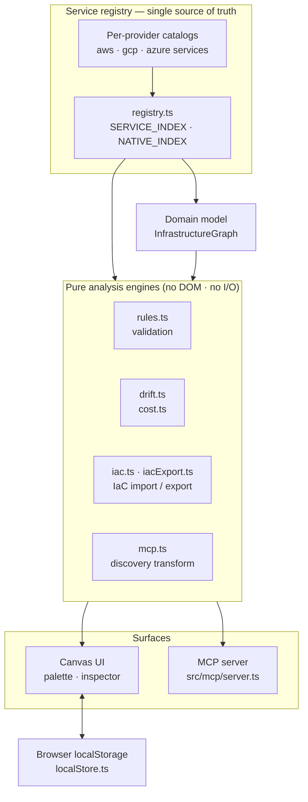

# Architecture & Engineering

Engineering documentation for contributors and maintainers of **Strata** — a
registry-driven canvas for modeling **multi-cloud (AWS, GCP, Azure)**
infrastructure as a typed graph of resources and relationships, persisted in the
browser (with a swappable server repository retained for a future durable
backend), and built to ingest live cloud state via Cloud Control / Cloud Asset
Inventory / Resource Graph.

Strata exists to make cloud infrastructure **legible**: to turn a sprawling
account (or many accounts) into a navigable, typed diagram that a human can read,
reason about, and edit.

## System at a glance

Everything radiates from the registry: the indexes feed the domain model, the pure
analysis engines, and the two surfaces (the canvas UI and the MCP server). Nothing
about a service is hardcoded downstream.

## Two design goals drive everything

1. **Model the broad multi-cloud service network, not a handful of icons.** The
   service vocabulary (AWS, GCP, Azure) lives in a single, extensible registry
   spanning 14 categories
   (networking, compute, containers, storage, database, integration, security,
   identity, monitoring, analytics, ai-ml, deployment, management, edge — see
   `src/aws/categories.ts`). Resources are connected with a rich, typed
   relationship vocabulary (`contains`, `routes_to`, `invokes`, `peers_with`, …)
   rather than anonymous lines.

2. **Everything visual and behavioural is _derived_ from data, never hardcoded.**
   The palette, node colours, icons, inspector forms, validation, and the MCP
   server's tools all read from the registry (`src/aws/registry.ts`). Supporting a
   new service (any provider) is a one-entry data change with **no UI code change**
   (see [Service Registry](/docs/architecture/service-registry)).

The stack is intentionally boring and self-contained: a single Next.js app, a domain
model decoupled from rendering, and browser-local persistence (`localStorage`) that
requires zero infrastructure to run. A server tier (the `/api/graphs` Route Handlers
plus a `Repository`) is retained for a future durable backend but is no longer on the
save/load path — see [Persistence](/docs/architecture/persistence).

## Positioning — what this is, and is not

AWS already ships
[Workload Discovery on AWS](https://github.com/aws-solutions/workload-discovery-on-aws)
for **discovering and visualizing existing infrastructure** (Config-driven,
Neptune + OpenSearch backed, deployed into your account). Strata deliberately does
**not** compete on that axis. It is positioned as a **design-first, local-first,
MCP-native** tool:

- **Design & validate before you build** — sketch a target architecture and get
  best-practice validation and rule suggestions (`src/aws/rules.ts`), not just a
  read-only picture of what already exists.
- **Local-first, zero infrastructure** — runs from a single Next.js process with a
  file store; no multi-service stack to deploy.
- **MCP-native** — the registry (typed relationships, `cfnType` join keys, config
  schemas) is built so an LLM/agent can reason over it, and a **running MCP server**
  (`src/mcp/server.ts`, `npm run mcp`) now exposes the registry, validation, IaC
  import/export, and cost engines as Model Context Protocol tools over stdio. The
  separate `src/aws/mcp.ts` is an unrelated pure **discovery transform**, and live
  discovery is a Cloud Control / CAI / Resource Graph SDK call (see
  [Live Discovery & MCP](/docs/architecture/mcp-integration)). The discovery intent
  is to **import a slice of reality to reconcile/annotate a design**, not to be a
  discovery platform.
- **Portable diagram-as-code** — the `InfrastructureGraph` JSON is
  version-controllable and not locked in a proprietary datastore.

## Layer map

| Layer                     | Location                                                                                                                         | Responsibility                                                |
| ------------------------- | -------------------------------------------------------------------------------------------------------------------------------- | ------------------------------------------------------------- |
| Service registry / schema | `src/aws/types.ts`, `src/aws/registry.ts`, `src/aws/categories.ts`, `src/aws/services/*.ts`, `src/gcp/*`, `src/azure/*`          | The canonical multi-cloud (AWS/GCP/Azure) vocabulary          |
| Domain model              | `src/aws/model.ts`, `src/aws/regions.ts`                                                                                         | Persisted environment representation                          |
| Canvas engine             | `src/canvas/*` (`geometry.ts`, `layout.ts`, `arrange.ts`, `navGrid.ts`), `src/aws/relationshipClasses.ts`, `src/aws/overlays.ts` | Pure geometry, containment layout, edge encoding, overlays    |
| Visual / UI               | `src/components/*` (incl. `AccessibleNodes.tsx`), `src/hooks/*`                                                                  | Palette, canvas, inspector + keyboard/screen-reader access    |
| Cost estimation           | `src/aws/cost.ts`                                                                                                                | Rough monthly cost heuristic (per-service + config)           |
| Drift detection           | `src/aws/drift.ts`                                                                                                               | Diff a diagram against a baseline (added/removed/changed)     |
| Merge / upsert            | `src/aws/merge.ts`                                                                                                               | Reconcile an incoming scan/import (ARN/identity-keyed upsert) |
| Persistence (live)        | `src/lib/localStore.ts`, `src/lib/snapshots.ts`                                                                                  | Browser `localStorage` save/load + local version snapshots    |
| Server tier (retained)    | `src/server/*`, `src/app/api/graphs/*`                                                                                           | Repository + Route Handlers, kept for a future backend        |
| Import / export           | `src/aws/mcp.ts`, `src/aws/discovery.ts`, `src/app/api/discover/*`, `src/aws/iac.ts`, `src/aws/iacExport.ts`, `src/aws/merge.ts` | Live-discovery transform + IaC import/export (+ merge)        |
| Rules engine              | `src/aws/rules.ts`                                                                                                               | Architecture validation + security-rule suggestions           |
| MCP server                | `src/mcp/server.ts`, `src/mcp/bin.ts`                                                                                            | Exposes the engines as MCP tools over stdio (`npm run mcp`)   |

## Section contents

- [Service Registry & Schema](/docs/architecture/service-registry)
- [Domain Data Model](/docs/architecture/data-model)
- [Visual Mapping](/docs/architecture/visual-mapping)
- [Rules & Validation Engine](/docs/architecture/rules-engine)
- [Drift Detection Engine](/docs/architecture/drift)
- [Persistence & the Server](/docs/architecture/persistence)
- [Live Discovery & MCP](/docs/architecture/mcp-integration)
- [IaC Import & Export](/docs/architecture/iac-import)
- [Testing](/docs/architecture/testing)
- [Docs Site (Authoring)](/docs/architecture/docs-site)
- [Roadmap](/docs/architecture/roadmap)
