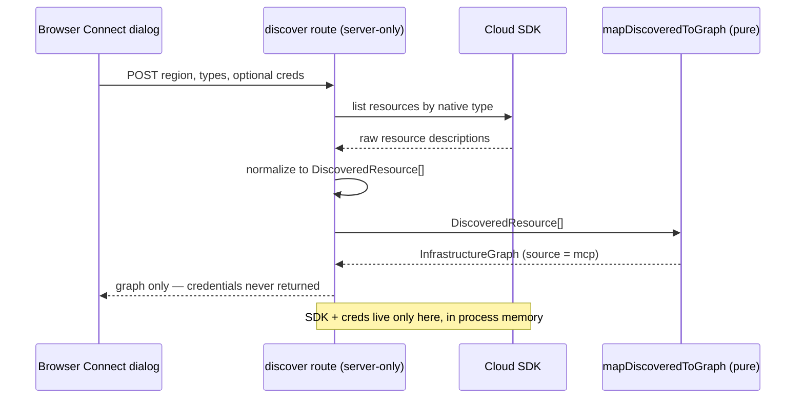
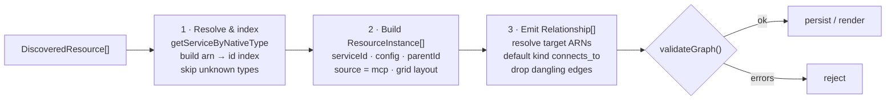

# Live Discovery & MCP Integration

> **Two distinct things share the "MCP" name here — keep them separate.**
> (1) A **running MCP server** at `src/mcp/server.ts` (entry `src/mcp/bin.ts`,
> launched with `npm run mcp`) that exposes Strata's engines as Model Context
> Protocol tools over stdio — see [The MCP server](#the-mcp-server) below.
> (2) `src/aws/mcp.ts`, an unrelated **pure discovery transform**
> (`mapDiscoveredToGraph`) that maps a flat list of discovered resources onto the
> graph; despite the filename it is _not_ the server and does no I/O. Live
> discovery itself is a **Cloud Control / CAI / Resource Graph SDK call** in the
> `src/app/api/discover/*` routes. The transform is shaped so a discovery
> producer's output feeds it unchanged.

The system ingests **live cloud state** — across AWS, GCP and Azure — not only
hand-drawn diagrams. Two layers cooperate:

- `src/aws/mcp.ts` — the **transform**: `DiscoveredResource`,
  `mapDiscoveredToGraph()`, and `unmappedTypes()`. A pure, dependency-free,
  **provider-agnostic** function that maps a flat list of discovered resources onto
  the registry-backed graph the canvas already renders.
- The **producers** that feed the transform, one per provider, each pure +
  fixture-testable with the SDK confined to a server-only route:
  - AWS — `src/aws/discovery.ts` + `src/app/api/discover/route.ts` (Cloud Control).
  - GCP — `src/gcp/discovery.ts` + `src/app/api/discover/gcp/route.ts` (Cloud Asset
    Inventory).
  - Azure — `src/azure/discovery.ts` + `src/app/api/discover/azure/route.ts`
    (Resource Graph).

  This is the layer that was previously "readiness only"; it is now wired up (the
  [Connecting to a Cloud](/docs/guide/connecting-aws) flow).

The transform module is intentionally a **pure, dependency-free transform**: it
takes a flat list of `DiscoveredResource` objects and maps them onto the
registry-backed graph the canvas already knows how to render.

End to end, a live scan keeps the SDK on the server and the transform pure — and
credentials never cross back to the browser or into the graph:



## `DiscoveredResource`

A single resource as surfaced by an MCP server / Cloud Control API / GCP Cloud
Asset Inventory / Azure Resource Graph, after light normalisation by the caller.
`resourceType` (the provider-native type) is the only strictly-required field for
mapping; `provider` selects the resolver namespace (defaults to `"aws"`).

```ts
export interface DiscoveredResource {
  arn?: string;
  /** Provider-native type — the registry join key (CFN / CAI / ARM type). */
  resourceType: string;
  /** Cloud provider for resolution (defaults to "aws"). */
  provider?: CloudProvider;
  logicalId?: string;
  name?: string;
  region?: string;
  accountId?: string;
  /** ARN of the logical containment parent (VPC for a subnet, etc.). */
  parentArn?: string;
  /** Raw CloudFormation/Cloud-Control properties for this resource. */
  properties?: Record<string, unknown>;
  /** Outgoing edges to other discovered resources, keyed by target ARN. */
  relationships?: { targetArn: string; kind?: string }[];
}
```

## The join key: `(provider, nativeType)`

Each `ServiceDefinition`'s provider-native type is the **join key** between a
discovered resource and the registry, resolved via
`getServiceByNativeType(provider, resourceType)` (indexed in `NATIVE_INDEX`). Each
provider's discovery API enumerates resources by exactly this type — AWS Cloud
Control by CloudFormation type, GCP Cloud Asset Inventory by asset type, Azure
Resource Graph by ARM type — so a discovered resource maps deterministically onto a
`ServiceDefinition`. (AWS resolution still works through `getServiceByCfnType`,
which is now a thin wrapper over `getServiceByNativeType("aws", …)`.) The
properties each API returns line up with the service's `configFields` to the
extent the field names match — see the caveat under
[Connecting to a Cloud](/docs/guide/connecting-aws#reviewing-and-importing) about
sparse GCP/Azure config.

## `mapDiscoveredToGraph`

The importer turns a list of discovered resources into an `InfrastructureGraph`. It
runs in three passes:

1. **Resolve & index.** For each discovered resource, resolve its type via
   `getServiceByNativeType(provider, type)`. Unknown types are skipped/flagged (and
   are candidates for new catalog entries). Mappable resources get a stable id
   (their ARN / full resource name, or a generated UUID) and an `arn → id` index is
   built.
2. **Build `ResourceInstance`s.** `serviceId` from the matched definition, `arn`
   and `region`/`accountId` from discovery, `config` filtered to the keys the
   service's `configFields` actually model, `parentId` resolved from `parentArn`,
   and `source: "mcp"` so the UI marks it as discovered (read-only-by-default
   trust). A simple grid auto-layout assigns positions so the graph renders without
   a layout engine.
3. **Emit typed `Relationship`s** from each resource's `relationships`, resolving
   target ARNs to graph ids and defaulting `kind` to `"connects_to"` when missing
   or invalid. Edges whose target is outside the discovered set are dropped.

The result must pass `validateGraph()` before persist. `unmappedTypes(resources)`
reports the distinct CFN types with no registry entry — surfacing registry gaps to
operators/developers.



## The producer (`discovery.ts` + `/api/discover`)

`src/aws/discovery.ts` is **pure and has no `@aws-sdk` import**, so it stays
browser-safe and unit-testable with fixtures:

- `listDiscoverableTypes()` — the registry-backed list of scannable CFN types
  (canonical winners only).
- `normalizeRecords()` — turns lenient or Cloud Control-shaped records (`TypeName`,
  `Identifier`, `Properties`) into `DiscoveredResource[]`.
- `parsePastedExport()` — accepts `aws cloudcontrol list-resources` output or a
  JSON array (the paste path; runs entirely client-side).
- `discoverWithClient(client, opts)` — scans each requested type against an injected
  `CloudControlLike` interface; per-type failures become warnings and **every
  attempted type is reported** (no silent caps).

The AWS SDK lives **only** in `src/app/api/discover/route.ts`, a server-only Route
Handler that lazily imports `@aws-sdk/client-cloudcontrol`, adapts the real
`CloudControlClient` (paginated `ListResources`, capped at 20 pages per type) to
`CloudControlLike`, and runs `discoverWithClient`. Errors are sanitised so SDK
internals never leak (credential/permission failures collapse to one generic
message, everything else to another, both `502`).

### GCP and Azure producers

The GCP and Azure producers mirror this shape exactly — a pure normalizer +
injected-client function, with the SDK confined to a lazy server route:

- **GCP** (`src/gcp/discovery.ts`): `listGcpDiscoverableTypes()`,
  `normalizeAssets()` (Cloud Asset Inventory assets → `DiscoveredResource[]`,
  tagged `provider: "gcp"`), `parseGcpExport()` (`gcloud asset list --format=json`),
  and `discoverGcpWithClient(client, opts)` against a `CloudAssetClientLike`.
  `src/app/api/discover/gcp/route.ts` lazily imports `@google-cloud/asset`, uses
  the server's **ambient ADC**, and decodes protobuf `Struct` resource data to
  plain JSON.
- **Azure** (`src/azure/discovery.ts`): `listAzureDiscoverableTypes()`,
  `normalizeRows()` (Resource Graph rows → `DiscoveredResource[]`, tagged
  `provider: "azure"`, with the resource group as the containment parent),
  `parseAzureExport()` (`az graph query -o json`), `buildResourceGraphQuery()`, and
  `discoverAzureWithClient(client, opts)` against a `ResourceGraphClientLike`.
  `src/app/api/discover/azure/route.ts` lazily imports `@azure/arm-resourcegraph` +
  `@azure/identity`, uses the server's **ambient `DefaultAzureCredential`**, and
  paginates by skip-token.

GCP/Azure have no bring-your-own-key path: they use ambient credentials only, so a
**hosted** deployment (`NEXT_PUBLIC_STRATA_HOSTED`) rejects their live scans (use
the paste path). Both adapters are marked `UNVERIFIED against live` — covered by
mocked route tests + fixture-based normalizer tests; a real authenticated smoke
test is the gate before relying on live scans.

### Two credential paths + hosted-mode gating

`POST /api/discover` accepts `{ region, types[], accountId?, creds? }` and chooses
its credentials per request:

- **Bring-your-own (`creds`).** The body may carry
  `{ accessKeyId, secretAccessKey, sessionToken? }`. These build the
  `CloudControlClient` for this one scan and are then discarded — never written to
  `.data/`, never logged, never returned. `parseCreds()` rejects a malformed
  `creds` object with a `422` ("bad-creds") rather than silently falling through
  to the ambient chain.
- **Ambient chain (no `creds`).** With `creds` omitted, the SDK's default chain
  (env / shared profile / SSO / instance role) is used. This is appropriate for a
  **single-user local** deployment where the operator's own credentials live on the
  box.

The ambient fallback is **gated by deployment mode**. When
`NEXT_PUBLIC_STRATA_HOSTED` is `1` or `true` (`isHosted()`), a scan with no `creds`
is rejected with a `422` — on a shared/hosted instance the ambient chain would be
the _operator's_ account, so every visitor must bring their own credentials (or use
the client-side paste path). Locally, with the flag unset, the ambient chain works
as the zero-config default.

The route is also behind the optional bearer-token guard (`requireAuth()`, see
[Persistence](/docs/architecture/persistence#auth-guard)) — when
`AWS_FLOW_API_TOKEN` is set, an unauthenticated discover request is `401` before any
of the above runs.

## Credential boundary (non-negotiable)

- **Read-only roles only.** Discovery uses read/describe/list permissions; the app
  never needs mutate permissions on the target AWS account.
- **Scoped, short-lived sessions.** Assume a role per import with the narrowest
  policy and a short session TTL; scope by account + region.
- **NEVER persist credentials.** Credentials live only in process memory for the
  duration of an import. They are never written to disk, never stored in an
  `InfrastructureGraph`, and never logged. Only the _resulting graph_ (ARNs/ids,
  config, relationships) is persisted. `src/aws/mcp.ts` enforces this by
  construction: it only ever receives already-fetched resource descriptions — no
  access keys, session tokens, or secrets pass through it. This holds for **every
  provider**: GCP ADC and Azure tokens are resolved by the SDK server-side and are
  never returned to the browser or written into the graph (a credential-safety test
  asserts this for each producer).

## The MCP server

`src/mcp/server.ts` (entry `src/mcp/bin.ts`) is a real **Model Context Protocol
server** that lets an agent drive Strata's engines headlessly. Run it with:

```bash
npm run mcp   # = npx -y tsx src/mcp/bin.ts
```

It speaks **JSON-RPC 2.0 over stdio** (protocol `2024-11-05`). The core,
`handleMcpMessage`, is a **pure** dispatcher (unit-tested in
`src/mcp/server.test.ts`) handling `initialize`, `notifications/initialized`,
`ping`, `tools/list`, and `tools/call`; `runStdio` wires it to stdin/stdout. It is
a thin wrapper over the same pure engines the UI uses — registry, rules, cost,
and IaC import/export — with **no DOM, no network, and no credentials**.

### Tools

| Tool                    | Input                                   | Backed by                                                                |
| ----------------------- | --------------------------------------- | ------------------------------------------------------------------------ |
| `list_services`         | `{ provider?, category?, query? }`      | registry (`allServices`/`searchServices`)                                |
| `get_service`           | `{ id }`                                | registry (`getService`)                                                  |
| `validate_architecture` | `{ graph }`                             | `validateArchitecture` ([rules engine](/docs/architecture/rules-engine)) |
| `suggest_rules`         | `{ graph }`                             | `suggestRules`                                                           |
| `import_iac`            | `{ content, name? }`                    | `importAnyIaC` ([IaC import](/docs/architecture/iac-import))             |
| `list_repo_roots`       | `{ path }`                              | `detectRepoRoots` (Terraform roots under a local path)                   |
| `connect_repo`          | `{ path, root?, roots?, strategy? }`    | `connectRepo` (local repo → layered graph)                               |
| `import_plan`           | `{ planJson }` or `{ repoPath, root? }` | `importPlanJson` / `runRepoPlan` (plan → graph + change diff)            |
| `export_iac`            | `{ graph, format }`                     | `exportIaC` (CloudFormation / Terraform)                                 |
| `estimate_cost`         | `{ graph }`                             | `estimateMonthlyCost` / `estimateTotal`                                  |

Because every tool delegates to a pure engine, the server stays in lockstep with
the app: a new registry entry or validation rule is immediately available over MCP
with no extra wiring. This is the running counterpart to the "MCP-native" framing
— distinct from the `src/aws/mcp.ts` discovery transform above.

The exceptions are the **companion** tools (`connect_repo`, `list_repo_roots`,
`import_plan`): they read the local filesystem and may shell out to
`terraform`/`tofu` (via `src/server/`), so they are **local-only** and not pure.
They still use **no cloud credentials** for `connect`, and never mutate the source
repo. Because a tool can now do async work, `handleMcpMessage` is `async` and
stdout writes are serialised to preserve order. See the
[Terraform Companion](/docs/guide/terraform-companion) guide.
