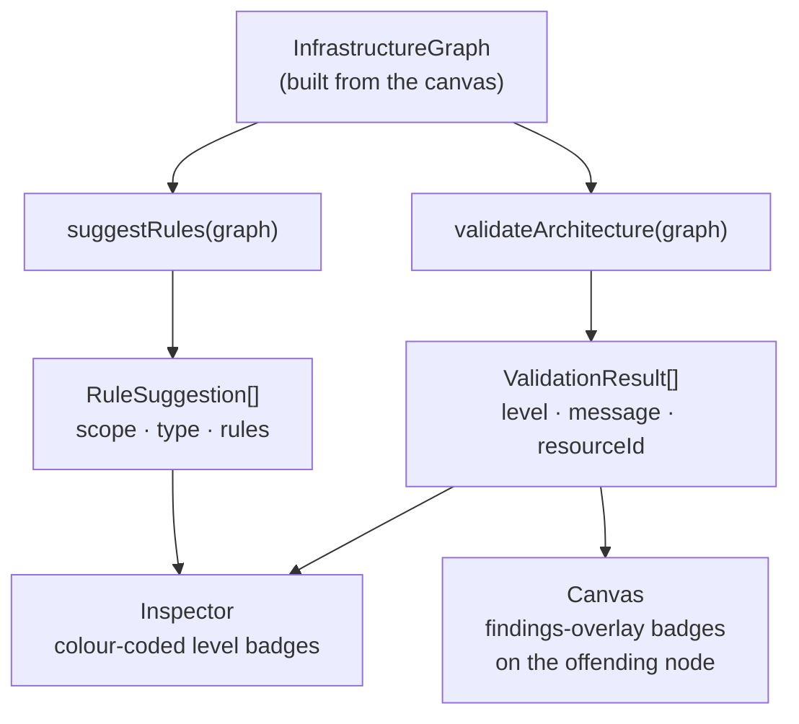

# The Rules & Validation Engine

`src/aws/rules.ts` is Strata's **best-practice engine** — the "design & validate
before you build" half of the positioning. It is a pure module over the
`InfrastructureGraph` (no UI, no I/O) that exposes two functions:

- **`validateArchitecture(graph) → ValidationResult[]`** — checks the drawn (or
  imported) graph against both **network topology** best practices _and_
  **config-level security / Well-Architected** best practices, across **AWS, GCP,
  and Azure**, returning findings.
- **`suggestRules(graph) → RuleSuggestion[]`** — proposes concrete security-group /
  route-table / NACL rules for the resources present.

Like the rest of the app, it is **registry-driven**: it matches resources by their
`ServiceDefinition.id` (e.g. `"vpc"`, `"subnet-public"`, `"route-table"`,
`"elastic-load-balancer"`) and edges by `RelationshipKind`, never by hardcoded UI
node-type strings.

## Result shapes

```ts
export interface ValidationResult {
  level: "error" | "warn" | "ok";
  message: string;
  resourceId?: string; // the resource the finding is about — lets the UI badge that node
}

export interface RuleSuggestion {
  scope: string; // the resource the rules attach to (by name)
  type: string; // "Security Group" | "Route Table" | "NACL"
  rules: Record<string, unknown>[]; // the proposed rule rows
}
```

The engine returns **structured data, not HTML or formatted strings** — message
text is plain, and the UI is responsible for rendering. This keeps the engine
testable and keeps user-controlled names out of any HTML sink (see
[How results surface](#how-results-surface)).

## What `validateArchitecture` checks

The validator runs two families of checks: **network topology** (below) and
**config-level security / Well-Architected** (further down). Topology checks are
**topology-aware but not policy-aware** — they reason over the modeled graph
(placement + typed edges), not over real SG rules, NACL entries, or IAM evaluation
(see [Roadmap → item 2](/docs/architecture/roadmap)).

### Network topology checks

| Check                                                                   | Level |
| ----------------------------------------------------------------------- | ----- |
| A subnet must be contained by a VPC                                     | error |
| A subnet's CIDR must fall inside its VPC's CIDR                         | error |
| A Route Table should be attached to at least one subnet                 | warn  |
| A NACL should be attached to at least one subnet                        | warn  |
| An Internet Gateway must be attached to a VPC                           | error |
| A public subnet should route to an Internet Gateway via its Route Table | error |
| A NAT Gateway should sit in a **public** subnet                         | error |
| A private subnet usually needs a Route Table routing to a NAT Gateway   | warn  |
| A Load Balancer should sit in a public subnet…                          | warn  |
| …with public subnets in **≥ 2 Availability Zones**                      | error |
| A Load Balancer should target a Target Group                            | warn  |
| A Target Group should target valid compute (ECS / EC2 / Lambda / ALB)   | warn  |
| An ECS Service must be in subnet(s) and attached to a Security Group    | error |
| RDS should be in **private** subnet(s) and attached to a Security Group | warn  |

### Security & Well-Architected checks (AWS · GCP · Azure)

These read resource **config** and fire only on an explicit, insecure value — so
secure defaults and sparse imports don't generate noise. Matching is by registry
`serviceId`, including the `gcp-`/`azure-` services, so coverage is multi-cloud.

| Check                                                                                          | Level |
| ---------------------------------------------------------------------------------------------- | ----- |
| **AWS** — S3 Block Public Access disabled                                                      | warn  |
| Encryption-at-rest off (EBS / EFS / RDS / DocumentDB / Neptune)                                | warn  |
| Security Group exposes a sensitive port (22/3389/3306/5432/1433/6379) to `0.0.0.0/0` or `::/0` | warn  |
| RDS publicly accessible                                                                        | error |
| DynamoDB point-in-time recovery off                                                            | warn  |
| RDS/Aurora deletion protection off; RDS backup retention 0                                     | warn  |
| EC2 allows IMDSv1 (token not required)                                                         | warn  |
| ALB has an unencrypted HTTP listener                                                           | warn  |
| Unattached EBS volume (idle cost)                                                              | warn  |
| **GCP** — Cloud Storage uniform bucket-level access off / public access prevention inherited   | warn  |
| Firewall INGRESS ALLOW of a sensitive port from `0.0.0.0/0`                                    | warn  |
| Cloud SQL public IPv4 / SSL not required                                                       | warn  |
| **Azure** — Storage account allows public blob access / non-HTTPS / TLS < 1.2                  | warn  |
| Redis non-SSL port enabled                                                                     | warn  |
| SQL Server public network access enabled; SQL Database TDE disabled                            | warn  |

> Each finding carries the offending resource's `resourceId`, so the UI can badge
> that exact node (see [How results surface](#how-results-surface)).

### Direction-agnostic containment

Real graphs model containment inconsistently — a hand-drawn graph may use a
`contains` edge while an imported/MCP graph uses `parentId`, and edges may point
either way. The validator absorbs this with three internal helpers so a correct
architecture never false-positives on edge direction:

- **`containerOf(child, match)`** — resolves the containing resource via
  `parentId` **or** a `contains`/`attached_to` edge in either direction.
- **`subnetsOf(resource)`** — every subnet a resource is placed in, by the same
  union of signals.
- **`routeTableFor(subnet)`** — the attached Route Table, direction-agnostic.

### Real CIDR math

The VPC-containment check is genuine subnet arithmetic, not string matching:
`parseCidr()` / `ipv4ToInt()` parse `a.b.c.d/m` to a network/broadcast `uint32`
range (rejecting malformed input and handling the `/0` shift edge case), and
`cidrContains(parent, child)` returns true only when the child range sits inside
the parent's. A malformed CIDR surfaces as a finding rather than silently passing.

## What `suggestRules` proposes

`suggestRules` walks the same graph and emits ready-to-apply rule scaffolds:

- **ALB →** a Security Group ingress for `80,443` from `0.0.0.0/0`, plus — by
  tracing `targets` edges (ALB → Target Group → service) — an ingress on the
  backing service's Security Group from the ALB's SG (`guessServicePort` reads the
  service's `port` config, defaulting to `80`).
- **Public subnet →** a Route Table default route to an Internet Gateway.
- **Private subnet →** a Route Table default route to a NAT Gateway.
- **NACL →** sensible ephemeral-return-traffic and egress entries.

These are **suggestions**, not state the engine writes anywhere — they render in
the Inspector for the user to read and apply by hand.

## How results surface

Both functions take the built graph and return structured data; the flow store
fans the findings out to the Inspector list and to on-canvas node badges:



The engine is invoked from the flow store and rendered by the Inspector:

1. `useFlowStore`/`useFlow` (`src/hooks/useFlow.tsx`) expose `runValidate` and
   `runSuggest`. Each calls `buildGraph()` and stores the result in React state
   (`validationResults` / `ruleSuggestions`), both starting `null` (= "not run
   yet").
2. The **Inspector** (`src/components/Inspector.tsx`) renders the
   `ValidationAndRules` panel. **Validation** shows each finding as a coloured
   level badge (`error` → danger, `warn` → yellow, `ok` → green via `levelColor`)
   plus its message; an empty array renders "No issues found." **Rule Suggestions**
   groups rule rows under each `scope`/`type`.
3. Because the engine returns structured objects, the Inspector builds plain-text
   React children — user-controlled names are escaped by React, so there is **no
   HTML-injection surface** even though messages embed resource names.
4. **On-canvas badging.** Validation also runs _live_ (a `liveFindings` memo over
   the current graph). Findings that carry a `resourceId` are dotted on that node
   via the shared `findings-overlay` in `Canvas.tsx` — the same screen-space
   marker pattern used by cost and drift — colour-coded by severity, with a
   corner summary of error/warning counts. So a finding surfaces both in the
   Inspector list and on the node it concerns.

## Authoring a new rule or suggestion

There is no rule DSL — checks are plain TypeScript inside
`validateArchitecture` / `suggestRules`. To add one:

1. **Match by registry id and edge kind.** Use the in-function helpers —
   `ofService(id)`, `incoming(id, kind)`, `outgoing(id, kind)`, `get(id)`,
   `cfgStr(resource, key)` — and prefer the direction-agnostic `containerOf` /
   `subnetsOf` / `routeTableFor` over reading a single edge direction, so the rule
   holds for hand-drawn **and** imported graphs.
2. **Push a `ValidationResult`** with the right `level` (reserve `error` for things
   that are definitely broken, e.g. an IGW with no VPC; use `warn` for
   "usually wrong"), or push a `RuleSuggestion` block of rule rows.
3. **Add a test** in `src/aws/rules.test.ts` (the suite is extensive — build a
   small fixture graph and assert the finding appears / does not appear). The
   tests run in CI (see [Testing](/docs/architecture/testing)).

If a check needs a service that isn't modeled yet, add it to the registry first
(one catalog entry — see [Service Registry](/docs/architecture/service-registry)).
