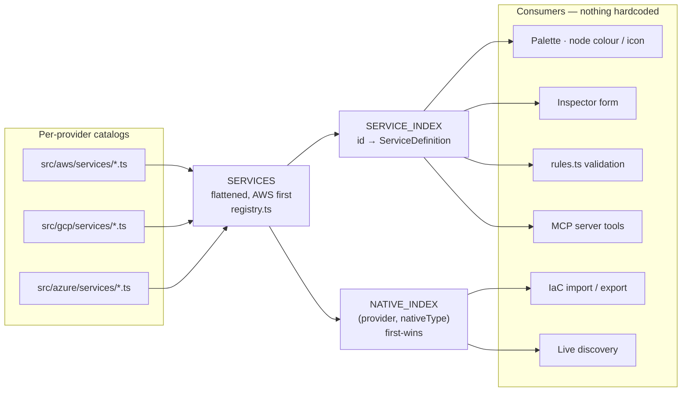

# The Service Registry & Schema

The registry is the single source of truth for cloud service metadata, across
**AWS, Google Cloud and Azure**. The UI, validation engine, and discovery/IaC
importers all read from it — nothing about a service is hardcoded elsewhere.

It is **multi-cloud by composition**: AWS is the original (and default) provider,
with GCP and Azure catalogs flattened in alongside it. A `CloudProvider`
(`"aws" | "gcp" | "azure"`, with `CLOUD_PROVIDERS` as the runtime list) tags each
service, and a provider-namespaced `nativeType` is the cross-layer join key.

## Schema (`src/aws/types.ts`)

The registry is built from a small set of structures.

### `ServiceDefinition`

The reusable definition of one AWS service. Key fields:

- `id` — canonical kebab-case id, **globally unique** across providers (AWS uses
  bare ids like `"ec2-instance"`; GCP/Azure prefix theirs, e.g. `"gcp-compute-engine"`,
  `"azure-vm"`).
- `provider` — `CloudProvider` (`"aws" | "gcp" | "azure"`). **Optional**: an entry
  without it is treated as `"aws"`, so the existing AWS catalogs needed no edit.
- `name` / `fullName` / `abbreviation` — display strings.
- `category` — one of the 14 `ServiceCategoryId`s (shared across providers); drives
  palette grouping and the default colour.
- `icon` — an emoji token.
- `scope` — a `ServiceScope`
  (`global | region | az | vpc | subnet | project | resource-group`) describing
  where the resource conceptually lives. `project` (GCP) and `resource-group`
  (Azure) were added for the new providers (see
  [Data Model → placement scopes](/docs/architecture/data-model#placement-scopes)).
- `isContainer` — `true` for services that visually contain others (VPC, Subnet,
  Azure Resource Group).
- `color` — optional per-service override; otherwise the category colour wins.
- `configFields` — the dynamic inspector form schema (see `ConfigField`).
- `commonConnections` — suggested outgoing edges for hints / auto-wiring.
- `nativeType` — the **provider-native resource type**: the cross-layer join key
  for IaC import/export and live discovery. AWS = CloudFormation type
  (`AWS::EC2::Instance`); GCP = Cloud Asset Inventory type
  (`compute.googleapis.com/Instance`); Azure = ARM type
  (`Microsoft.Compute/virtualMachines`).
- `cfnType` — the AWS CloudFormation type. For AWS entries it equals `nativeType`;
  the registry falls back to it when `nativeType` is absent, so AWS catalogs keep
  using `cfnType` unchanged (see [MCP Integration](/docs/architecture/mcp-integration)).
- `cfnPropertyNames` — optional map of config-key → provider-native property name,
  used to emit real property names on export where they differ from Strata's keys.
- `arnPattern`, `keywords`, `docsUrl` — reference / search metadata.

```ts
export interface ServiceDefinition {
  id: string;
  provider?: CloudProvider; // defaults to "aws"
  name: string;
  fullName: string;
  abbreviation?: string;
  category: ServiceCategoryId;
  description: string;
  icon: string;
  scope: ServiceScope; // + "project" | "resource-group"
  isContainer?: boolean;
  color?: string;
  configFields: ConfigField[];
  commonConnections: CommonConnection[];
  nativeType?: string; // the cross-provider join key
  cfnType?: string; // AWS; === nativeType, the fallback for it
  cfnPropertyNames?: Record<string, string>;
  arnPattern?: string;
  keywords?: string[];
  docsUrl?: string;
}
```

### `ConfigField`

One configurable property: `key`, `label`, `type`
(`string | number | boolean | select | multiselect | cidr | text | arn | tags`),
plus `default`, `options`, `required`, `help`, `placeholder`, and `group`. The
inspector renders a form purely from these — no per-service form code.

### `RelationshipKind`

The typed-edge vocabulary (16 kinds in `types.ts`). Each has
presentation/validation metadata in `RELATIONSHIPS` (`src/aws/categories.ts`): a
`label`, `description`, a `solid`/`dashed` style hint, and a `symmetric` flag
(e.g. `peers_with`). The full list: `contains`, `attached_to`, `routes_to`,
`depends_on`, `allows`, `targets`, `reads_from`, `writes_to`, `invokes`,
`publishes_to`, `subscribes_to`, `assumes`, `grants`, `monitors`, `peers_with`,
`connects_to`.

### `CategoryDefinition`

Presentation metadata per category: `color` (hex, used for node accenting and the
legend) and `icon`. Defined in `CATEGORIES` and ordered by `CATEGORY_ORDER`
(`src/aws/categories.ts`).

## Registry aggregation (`src/aws/registry.ts`)

`registry.ts` imports every provider's category catalogs — AWS from
`src/aws/services/*.ts`, GCP from `src/gcp/services/*.ts`, Azure from
`src/azure/services/*.ts` — `flat()`-tens them into one `SERVICES` list (AWS
first, preserving its order), and builds two indexes:

- `SERVICE_INDEX` — `id → ServiceDefinition` for O(1) lookup (ids are globally
  unique).
- `NATIVE_INDEX` — `(provider, nativeType) → ServiceDefinition`, the join table the
  IaC and discovery layers use, keyed `"<provider>|<nativeType>"`. `nativeType` is
  **not unique within a provider**: the registry intentionally models variants of
  one native type as distinct services (e.g. public vs private `AWS::EC2::Subnet`,
  or Azure App Service and Functions both on `Microsoft.Web/sites`). The index is
  **first-wins** — the first service for a `(provider, type)` pair becomes the
  canonical variant `getServiceByNativeType` returns; each subsequent collision is
  recorded in `NATIVE_TYPE_COLLISIONS` and surfaced as a **warning** by
  `validateRegistry()` (not an integrity error). For AWS entries the key falls back
  to `cfnType` via `serviceNativeType()`, so the AWS path is unchanged.



Public accessors include `getService`, `requireService`,
`getServiceByNativeType(provider, type)`, `getServiceByCfnType` (a thin
AWS-scoped wrapper, kept for the existing CloudFormation/MCP call sites),
`serviceProvider` (effective provider, defaulting to `"aws"`), `serviceNativeType`
(`nativeType ?? cfnType`), `allServices(provider?)`, `servicesByCategory(category,
provider?)`, `serviceColor`, `serviceIcon`, `defaultConfig`, and
`searchServices(query, provider?)` — the provider-filtered overloads back the
palette's All / AWS / GCP / Azure selector.

`validateRegistry()` is a guardrail returning `RegistryIssue[]` (each
`level: "error" | "warn"`): `error`s for duplicate ids and unknown categories, and
`warn`s for dangling `commonConnections` targets and shared-`nativeType` collisions.
**It is wired into CI** — `src/aws/registry.test.ts` asserts there are zero
error-level issues, so a bad catalog entry fails the build (see
[Testing](/docs/architecture/testing)).

## How to add a new service — one catalog entry, no UI changes

1. Open the catalog for the service's category, e.g.
   `src/aws/services/networking.ts`. Use that file as the canonical template:
   every entry is a `ServiceDefinition` and the file's **default export is the
   array**.
2. Append a new object. Minimal example (modeled on the VPC entry in
   `networking.ts`):

   ```ts
   {
     id: "global-accelerator",
     name: "Global Accelerator",
     fullName: "AWS Global Accelerator",
     category: "edge",
     description: "Improves availability and performance via the AWS global network.",
     icon: "🚀",
     scope: "global",
     cfnType: "AWS::GlobalAccelerator::Accelerator",
     keywords: ["accelerator", "anycast", "edge"],
     configFields: [
       { key: "ipAddressType", label: "IP Address Type", type: "select",
         default: "IPV4", options: [
           { value: "IPV4", label: "IPv4" },
           { value: "DUAL_STACK", label: "Dual Stack" },
         ] },
     ],
     commonConnections: [
       { to: "elastic-load-balancer", relationship: "targets" },
     ],
   }
   ```

3. That's it. The palette section, node colour/icon, inspector form, search, and
   import mapping all pick it up automatically because they read the registry.
   If you reference a new category, add it to both `CATEGORIES` and
   `CATEGORY_ORDER` in `src/aws/categories.ts`.
4. Run `validateRegistry()` to confirm there are no duplicate ids, dangling
   `commonConnections.to` targets, or `cfnType` collisions.
